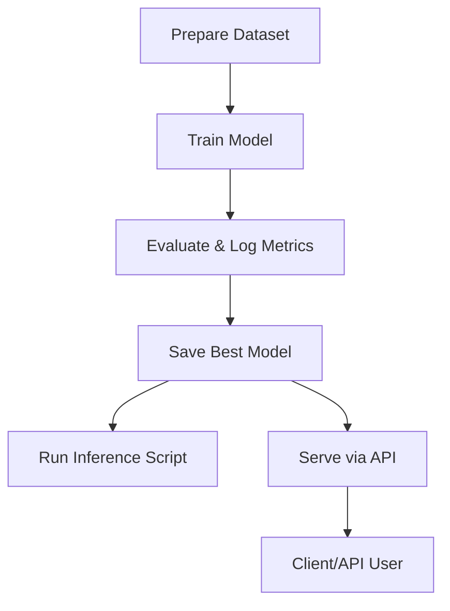

# Backend ML Project

[](https://www.python.org/)  
[](LICENSE)

---

A robust backend machine learning system for training, evaluating, and serving image classification models, with a modern API for AI-generated image detection.

---

## 🚀 Key Features

- **Vision Transformer (ViT) Model** for AI-generated vs. real image classification
- **Advanced Training Pipeline** with improved data augmentation and monitoring
- **REST API** for batch image analysis (FastAPI-based)
- **Easy Inference** via scripts or API
- **TensorBoard** logging for training visualization
- **Modular, extensible codebase**

---

## 📁 Project Structure

```
backend/
├── config.py              # Configuration settings
├── dataset.py             # Dataset utilities
├── env/                   # Python virtual environment (not tracked)
├── logs/                  # Training logs and visualizations
│   └── improved_vit/      # TensorBoard event files
├── main.py                # Main entry point
├── models/                # Saved model artifacts (.pth files)
├── quick_start.py         # Quick start script
├── requirements.txt       # Python dependencies
├── run_improved_training.py # Improved training script
├── server/                # API server (FastAPI)
│   ├── api.py             # API endpoints
│   ├── inference.py       # Inference logic
│   ├── model/             # Model files for serving
│   ├── package.json       # Node.js dependencies (if any)
│   └── node_modules/      # Node.js packages (not tracked)
├── train.py               # Training script
├── train_improved.py      # Improved training script
├── utils.py               # Utility functions
├── vision_transformer.py  # Vision Transformer model
└── IMPROVEMENTS.md        # Project improvement notes
```

---

## 🛠️ Technologies Used

- **Python 3.10+**
- **PyTorch** (Deep Learning)
- **FastAPI** (REST API)
- **Albumentations** (Image Augmentation)
- **TorchVision** (Image Processing)
- **TensorBoard** (Visualization)
- **Uvicorn** (ASGI Server)
- **Flask** (optional, legacy support)

---

## 🧩 Project Workflow



---

## ⚡ Quick Start

1. **Clone the repository:**
   ```sh
   git clone <repo-url>
   cd backend
   ```
2. **Create and activate a virtual environment:**
   ```sh
   python -m venv env
   # On Windows:
   .\env\Scripts\activate
   # On Unix/Mac:
   source env/bin/activate
   ```
3. **Install dependencies:**
   ```sh
   pip install -r requirements.txt
   ```

---

## 🏋️‍♂️ Training & Inference

- **Train the model:**
  ```sh
  python train.py
  # or for improved training
  python train_improved.py
  ```
- **Run inference on an image:**
  ```sh
  python inference.py --model_path models/best_model_improved.pth --image_path your_image.jpg
  ```
- **Monitor training:**
  ```sh
  tensorboard --logdir logs/improved_vit
  ```

---

## 🌐 Server API

The API server (in `server/`) uses **FastAPI** to provide a REST endpoint for batch image analysis.

### Start the API Server

```sh
cd server
uvicorn api:app --reload
```

### Main Endpoint

#### `POST /analyze`
- **Description:** Analyze one or more images to determine if they are AI-generated or real.
- **Request:**
  - `multipart/form-data` with one or more files (field name: `files`)
- **Response:**
  - JSON array, one object per image:
    - `filename`: Name of the image file
    - `prediction`: "AI-Generated" or "Real"
    - `confidence`: Model confidence (0-1)
    - `ai_generated_probability`: Probability image is AI-generated
    - `real_probability`: Probability image is real

**Example using `curl`:**
```sh
curl -F "files=@image1.jpg" -F "files=@image2.png" http://127.0.0.1:8000/analyze
```
**Sample Response:**
```json
[
  {
    "filename": "image1.jpg",
    "prediction": "AI-Generated",
    "confidence": 0.98,
    "ai_generated_probability": 0.98,
    "real_probability": 0.02
  },
  {
    "filename": "image2.png",
    "prediction": "Real",
    "confidence": 0.95,
    "ai_generated_probability": 0.05,
    "real_probability": 0.95
  }
]
```

---

## 📈 Improvements & Research

See [IMPROVEMENTS.md](IMPROVEMENTS.md) for a detailed list of model and pipeline improvements, including:
- Higher image resolution
- Enhanced ViT architecture
- Advanced data augmentation
- Improved training techniques
- Better monitoring and logging

---

## 🤝 Contributing

Contributions, issues, and feature requests are welcome! Please open an issue or submit a pull request.

---

## 📄 License

This project is licensed under the MIT License.

---

## ❓ FAQ / Troubleshooting

- **Training is slow:**
  - Try reducing batch size or number of epochs in `config.py`.
  - Ensure you are using a GPU if available.
- **Accuracy is not improving:**
  - Check your dataset quality and balance.
  - Try increasing training epochs or adjusting learning rate.
- **API server not starting?**
  - Ensure all dependencies are installed and the model file exists in `server/model/`.
- **Where are logs and models?**
  - See the `logs/` and `models/` directories. These are not tracked by git.

---

For more details, see the code and documentation in each module, or open an issue for help! 